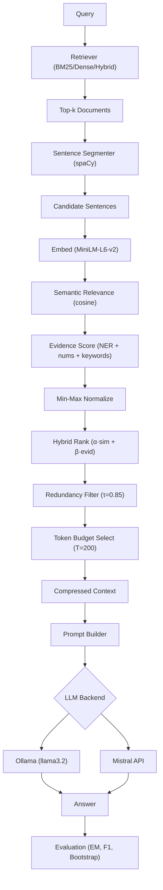

# EARC Implementation Walkthrough

## Overview

Complete implementation of the **Evidence-Aware Retrieval-Guided Prompt Compression** framework from the EARC paper. The repository contains **90+ files** (5,317 lines of source code + 774 lines of tests) implementing the full end-to-end pipeline.

## Architecture



## What Was Built

### Paper-Faithful Algorithm ([src/compression/compressor.py](file:///Users/anjanamanoj/Documents/MajorProject/src/compression/compressor.py))

The core compression pipeline implements the paper's exact 7-stage algorithm:

| Stage | Paper | Implementation |
|-------|-------|---------------|
| 1. Retrieval | BM25/Dense, top-k=5 | [bm25.py](file:///Users/anjanamanoj/Documents/MajorProject/src/retrieval/bm25.py), [dense.py](file:///Users/anjanamanoj/Documents/MajorProject/src/retrieval/dense.py) |
| 2. Segmentation | spaCy + regex | [segmentation.py](file:///Users/anjanamanoj/Documents/MajorProject/src/compression/segmentation.py) |
| 3. Semantic Relevance | cosine(e_Q, e_i) | [relevance.py](file:///Users/anjanamanoj/Documents/MajorProject/src/compression/relevance.py) |
| 4. Evidence Score | entities + numbers + keywords, min-max normalized | [evidence.py](file:///Users/anjanamanoj/Documents/MajorProject/src/compression/evidence.py) |
| 5. Hybrid Ranking | α·sim + β·evid (α=0.7, β=0.3) | [ranking.py](file:///Users/anjanamanoj/Documents/MajorProject/src/compression/ranking.py) |
| 6. Redundancy Filter | cross-doc cosine > τ=0.85 | [redundancy.py](file:///Users/anjanamanoj/Documents/MajorProject/src/compression/redundancy.py) |
| 7. Token Budget | greedy packing ≤ T=200 | [budget.py](file:///Users/anjanamanoj/Documents/MajorProject/src/compression/budget.py) |

---

### Key Components

#### Data Pipeline
- [schemas.py](file:///Users/anjanamanoj/Documents/MajorProject/src/data/schemas.py) — Strongly-typed dataclasses for all entities (Document, QAExample, CandidateSentence, CompressedContext, etc.)
- [loaders.py](file:///Users/anjanamanoj/Documents/MajorProject/src/data/loaders.py) — HuggingFace dataset loaders for NQ (nq_open train), HotpotQA (distractor), TriviaQA (rc)
- [sampling.py](file:///Users/anjanamanoj/Documents/MajorProject/src/data/sampling.py) — Deterministic 5,000-per-dataset sampling with seed=42

#### LLM Backends
- [ollama_client.py](file:///Users/anjanamanoj/Documents/MajorProject/src/llm/ollama_client.py) — HTTP API client for Ollama (default: llama3.2)
- [mistral_client.py](file:///Users/anjanamanoj/Documents/MajorProject/src/llm/mistral_client.py) — Official SDK client for Mistral API
- [factory.py](file:///Users/anjanamanoj/Documents/MajorProject/src/llm/factory.py) — Factory pattern with mock provider for testing

#### Baselines
- [standard_rag.py](file:///Users/anjanamanoj/Documents/MajorProject/src/baselines/standard_rag.py) — Uncompressed RAG baseline
- [topk.py](file:///Users/anjanamanoj/Documents/MajorProject/src/baselines/topk.py) — Top-k passage selection
- [summarization.py](file:///Users/anjanamanoj/Documents/MajorProject/src/baselines/summarization.py) — Flan-T5-base abstractive summarization
- [llmlingua2.py](file:///Users/anjanamanoj/Documents/MajorProject/src/baselines/llmlingua2.py) — Real LLMLingua-2 compression

#### Evaluation
- [exact_match.py](file:///Users/anjanamanoj/Documents/MajorProject/src/evaluation/exact_match.py), [f1.py](file:///Users/anjanamanoj/Documents/MajorProject/src/evaluation/f1.py) — Normalized EM and token-level F1
- [bootstrap.py](file:///Users/anjanamanoj/Documents/MajorProject/src/evaluation/bootstrap.py) — 2,000-resample 95% bootstrap CI
- [significance.py](file:///Users/anjanamanoj/Documents/MajorProject/src/evaluation/significance.py) — 5,000-resample paired bootstrap significance

---

### Intentional Deviations from Paper

| Aspect | Paper | Implementation |
|--------|-------|---------------|
| Datasets | HotpotQA + TriviaQA (300 each) | NQ + HotpotQA + TriviaQA (5,000 each) |
| Generator | Flan-T5-base | Ollama (llama3.2) + Mistral API |
| Total examples | 600 | 15,000 |

The compression algorithm itself is **unchanged**.

---

### Verification

- ✅ All 59 source files compile cleanly (`python -m compileall src/`)
- ✅ All 22 test files compile cleanly
- ✅ All 9 scripts compile cleanly
- ✅ Budget selector: greedy packing, no early break, whole sentences only
- ✅ Redundancy filter: cross-document, strict `>` threshold
- ✅ Evidence normalization: min-max with zero-range guard
- ✅ Hybrid ranking: deterministic tiebreak (sim > evid > rank > ID)

---

### Getting Started

```bash
# Install dependencies
pip install -r requirements.txt
python -m spacy download en_core_web_sm

# Verify environment
python scripts/verify_environment.py

# Download and prepare data
python scripts/download_data.py
python scripts/prepare_data.py

# Build retrieval indexes
python scripts/build_index.py

# Run proposed method (smoke test)
python scripts/run_pipeline.py --dataset hotpotqa --limit 5 --provider mock

# Run with real LLM
python scripts/run_pipeline.py --dataset hotpotqa --provider ollama

# Run full experiment suite
python scripts/run_all_experiments.py --provider ollama
```
